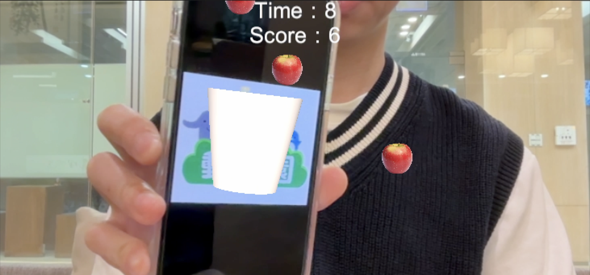
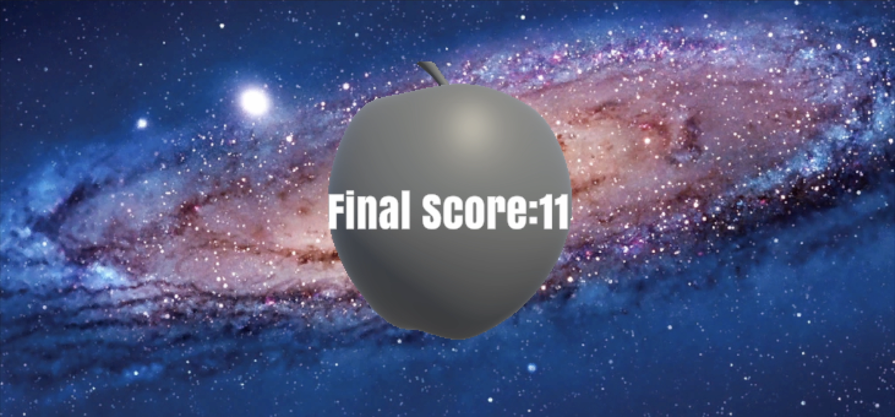

# AugmentedRealityCatchingGame

An augmented reality game developed with Unity and Vuforia where players catch falling apples using a basket attached to an image target. Players need to collect as many apples as possible within a limited time!

## 🎮 Game Features

- AR-based gameplay using Vuforia image tracking
- Virtual basket attached to a physical image marker
- Falling apples with random spawn positions
- Score tracking system
- Countdown timer and game duration management
- Game over screen with final score display
- Interactive 3D rotating apple model in the result screen

## 🛠 Technical Implementation

### Apple.cs
- Manages individual apple behavior
- Handles collision detection between the basket and apples using screen coordinates
- Implements automatic cleanup for apples that fall below the screen
- Uses `RectTransform` for UI positioning and `WorldToScreenPoint` for coordinate conversion

### GameManager.cs
- Core game logic controller implementing Singleton pattern
- Manages game states: countdown, gameplay, and game over
- Handles apple spawning with configurable intervals
- Controls UI updates for score and timer
- Manages scene transitions and score persistence

### GameOver.cs
- Manages the game over screen
- Retrieves and displays the final score using `PlayerPrefs`
- Implements debug logging for score verification

### AppleRotation.cs
- Controls the 3D apple model rotation in the game over screen
- Provides smooth continuous rotation using `Time.deltaTime`

## 🎯 Game Flow
1. Start screen with 3-2-1 countdown
2. Apples start falling from random positions at the top
3. Player moves the image target to catch apples with the AR basket
4. Score increases when apples overlap with the basket
5. Game ends after 25 seconds
6. Final score displayed with rotating apple animation

## 🔧 Technical Requirements
- Unity 2020.3 or higher
- Vuforia Engine
- Compatible AR-capable device
- Printed image target for basket tracking
